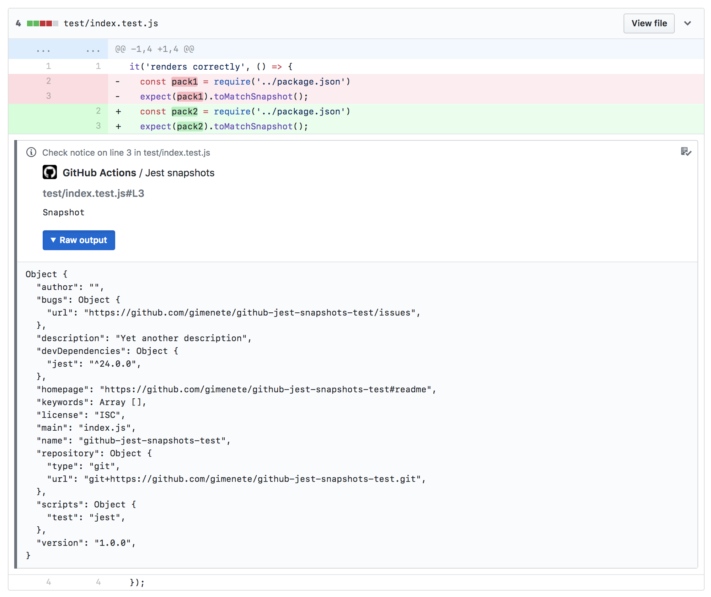

# GitHub Jest Snapshots

GitHub action that shows Jest Snapshots in the GitHub interface. Run it on every `push` event and it will add annotations to your commits whenever there's a `toMatchSnapshot()` call in your code.

**Requirements**

Your project should make use of Jest or it will fail.

**Limitations**

- If you use `toMatchSnapshot()` in nested callbacks, this action will probably not match the snapshot correctly
- Right now GitHub only shows annotations in modified lines of code. So it's most useful when the line that contains `toMatchSnapshot()` has actually changed
